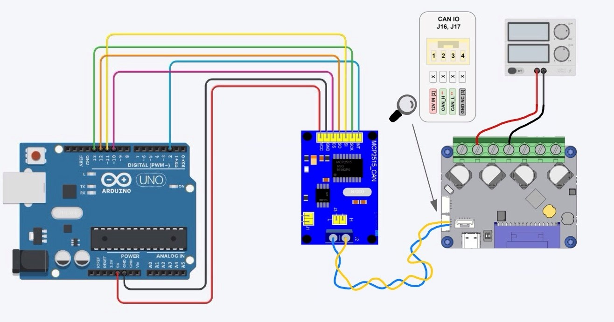

# Ardunio Odrive S1 CAN Bus Communication
This example script shows how to build a connection 
between an Arduino and the Odrive S1 (other Odrive models possible).
The example script is basically the Odrive-Arduino example script from Odrive itself,
but it is trimmed a little to exactly this hardware. 
The correct wiring of the used setup can be seen in this graphic.

But note that you you have to add a 120 Ohm resistor to both end nodes. 
Which means that you have to add a jumper to the MCP2515 and
you have to set the DIP switch (which says 'CAN no R' and '120R') to '120R'.

In this case we used an Arduino UNO as micro controller, but there are a lot of other MCUs possible to use.
In Order to transceive messages from the Odrive S1 the Ardunino needs a CAN module,
in our Case a module with the MCP2515 chip,
pretty much the basic CAN module for Arduino.

And of course also shown in the image, we are using an Odrive S1, and you can also see the 
CAN port of the odrive in close-up.